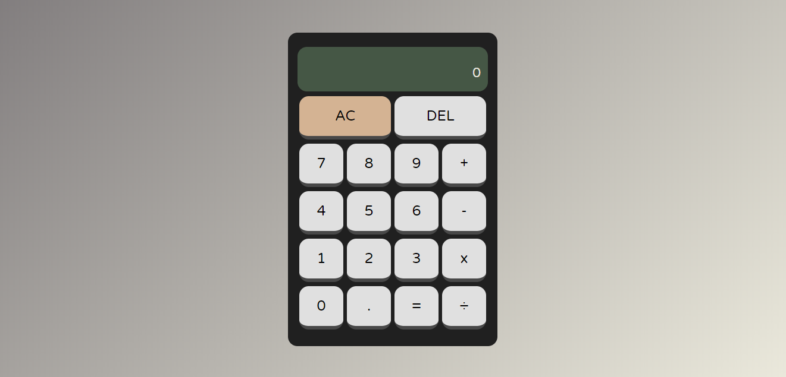

# Javascript Calculator

A calculator built with HTML5, CSS3, and Javascript.

A demo can be seen through this link:
[Javascript Calculator](https://maryamaljanabi.github.io/javascript-calculator/)

## License

- MIT License
- Copyright 2020 © [Maryam Aljanabi](https://github.com/maryamaljanabi)
